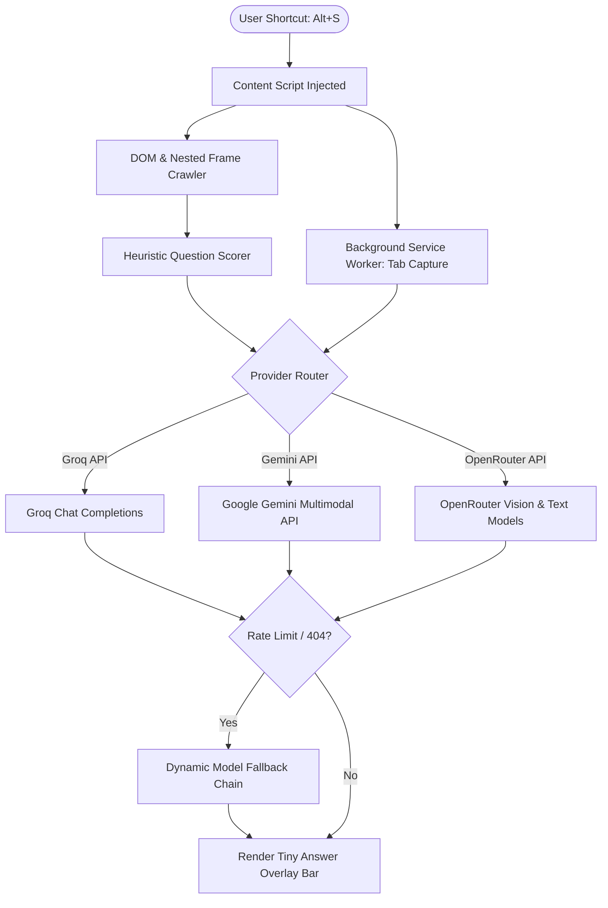

# ScreenQuizSolver

[](https://developer.chrome.com/docs/extensions/mv3/intro/)
[](LICENSE)
[](.github/workflows/ci.yml)
[](package.json)

**ScreenQuizSolver** is a high-performance, lightweight Google Chrome extension (Manifest V3) designed to scan quiz pages, parse questions across nested iframes, and display concise AI-generated answers in an ultra-discreet customizable bottom bar.

It features zero intermediary proxy servers, direct LLM client integrations (Groq, Google Gemini, OpenRouter), automatic model fallback and self-healing rate limit handling, and an anti-copy bypass layer for restrictive testing platforms.

---

## Key Features

- **Discreet Answer Bar**: Renders a compact, translucent overlay bar directly on the page without opening popups, tabs, or secondary windows.
- **Concise Formats**:
  - **Multiple Choice Questions (MCQ)**: Outputs strict option pointers (e.g., `Q1: Opt 2`).
  - **Fill-in-the-Blanks**: Outputs exact 1–2 word concise answers without verbose boilerplate.
- **Multi-Provider LLM Integration**:
  - **Groq**: Ultra-fast inference with automated live model discovery.
  - **Google Gemini**: Direct multimodal vision and text processing via Gemini 2.0 / 2.5 Flash.
  - **OpenRouter**: Access to a broad catalog of vision-capable and text-only models with multi-tiered fallback.
- **Deep Frame Extraction**: Recursively scans nested `<iframe>` and `<frame>` elements (common in LMS platforms such as Sakai, Canvas, Blackboard, and Moodle).
- **Anti-Copy Restriction Bypass**: Overrides CSS user selection blocks (`user-select: none`) and clears restrictive event listeners (`copy`, `cut`, `contextmenu`, `selectstart`).
- **One-Click Question Copying (`CopyQ`)**: Extracts the clean question text directly from the DOM tree and copies it to your clipboard.
- **Customizable Appearance**: Real-time controls for opacity, font size (8–18px), bar positioning (top/bottom), and auto-scan frequency.

---

## Architecture Flow



---

## Supported Providers & Models

| Provider | Recommended Model | Modality | Key Format | Acquisition |
| :--- | :--- | :--- | :--- | :--- |
| **Groq** *(Recommended)* | `openai/gpt-oss-120b`, `llama-3.3-70b` | Text | `gsk_...` | [console.groq.com](https://console.groq.com) |
| **Google Gemini** | `gemini-2.0-flash`, `gemini-2.5-flash` | Multimodal (Text + Vision) | `AQ...` | [aistudio.google.com](https://aistudio.google.com/app/apikey) |
| **OpenRouter** | `qwen/qwen3.8-27b:free`, `google/gemma-4-31b-it:free` | Multimodal / Text | `sk-or-v1...` | [openrouter.ai](https://openrouter.ai) |

> **Privacy Guarantee**: All API keys and preferences are stored exclusively inside Chrome's sandboxed `chrome.storage.sync`. Keys are never transmitted to any third-party telemetry, proxy, or intermediary server.

---

## Installation

1. Clone or download this repository:
   ```bash
   git clone git@github.com:gauthamram57/screen-quiz-solver.git
   cd screen-quiz-solver
   ```
2. Open Google Chrome (or Chromium-based browsers such as Brave, Edge) and navigate to:
   ```text
   chrome://extensions
   ```
3. Enable **Developer mode** via the toggle switch in the top-right corner.
4. Click **Load unpacked** and select the root directory of this repository (`screen-quiz-solver`).
5. Open or refresh (`Ctrl + R`) your quiz tab.

---

## Configuration & Usage

1. Click the **ScreenQuizSolver** extension icon in your Chrome toolbar.
2. Select your preferred **Provider** (e.g., Groq or Google Gemini).
3. Paste your API key into the API key field and select your desired model.
4. *(Optional)* Toggle screenshot usage (unchecking improves speed on text-only quizzes).
5. Click **Save Settings**.

### Keyboard Shortcuts

| Shortcut / Button | Function |
| :--- | :--- |
| <kbd>Alt</kbd> + <kbd>S</kbd> | Scan page text/screen and compute answers instantly |
| <kbd>Alt</kbd> + <kbd>H</kbd> | Toggle visibility of the answer bar |
| `Scan` | Manual trigger button on the overlay bar |
| `CopyQ` | Direct DOM question extraction to system clipboard |
| `–` | Collapse overlay bar |

---

## Repository Structure

```text
screen-quiz-solver/
├── .github/
│   └── workflows/
│       └── ci.yml             # GitHub Actions CI workflow (linting, tests, package)
├── icons/                     # Extension branding icons (16px, 32px, 48px, 128px)
├── lib/
│   └── extractor.js           # Heuristic DOM question extraction engine
├── scripts/
│   └── package.js             # Distribution packaging script
├── tests/
│   └── extractor.test.js      # Automated unit test suite
├── background.js              # Service worker for viewport capture
├── content.css                # Answer bar styling
├── content.js                 # Content script: overlay UI, event listeners, API clients
├── manifest.json              # Chrome Extension Manifest V3 configuration
├── popup.html                 # Quick configuration popup interface
├── popup.js                   # Popup logic and sync management
├── options.html               # Options and usage documentation page
├── package.json               # Project manifest and test runner scripts
├── CONTRIBUTING.md            # Guidelines for open-source contributors
├── LICENSE                    # MIT License
└── README.md                  # Project documentation
```

---

## Development & Testing

### Syntax Verification
Validate all JavaScript files:
```bash
npm run check
```

### Unit Tests
Execute the built-in test suite:
```bash
npm test
```

### Build Distribution Package
Generate a production zip archive inside `dist/`:
```bash
npm run package
```

---

## License

This project is licensed under the [MIT License](LICENSE) - Copyright (c) 2026 **Gautham Ram**.
